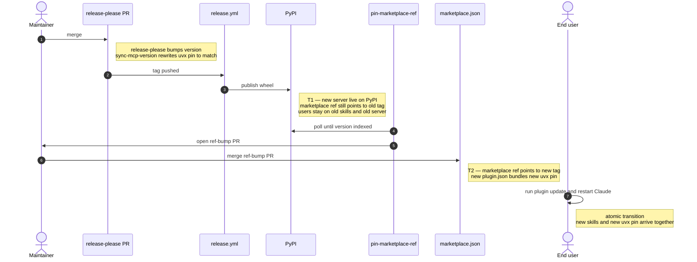

# Release process

## Release atomicity (Claude Code)

End users must never see a mismatched (skills + server) pair, so the
release pipeline coordinates two pins:




1. **`plugin/.claude-plugin/plugin.json` keeps `$.version` and the
   `mcpServers.db-context-engineering.args[0]` uvx pin
   (`google-cloud-db-context-engineering@<version>`) in sync.**
   - `release-please` bumps `$.version` directly via its `json` updater.
   - `.github/workflows/sync-mcp-version.yml` runs on each
     release-please PR and amends a follow-up commit that rewrites
     `args[0]` to match. The same workflow also syncs the root
     `gemini-extension.json` consumed by Antigravity — see the
     [Antigravity section](#release-atomicity-antigravity-cli) below.
   - The `validate-mcp-version-pin` presubmit job fails any PR where
     the two fields diverge in either manifest — a guard in case the
     sync workflow silently breaks.
2. **`.claude-plugin/marketplace.json` `source.ref` points at the
   latest released tag.**
   - The `pin-marketplace-ref` job in `release.yml` waits for the PyPI
     wheel to be indexed before opening the bump PR, so the
     marketplace never points at a version `uvx` cannot install.

The transition point is the merge of `pin-marketplace-ref`'s PR: before
the merge users stay on the old `(skills, server)` pair, after the
merge `/plugin update` + Claude restart flips both pins to the new
version together. The restart is required because Claude Code's
`/reload-plugins` does not respawn the MCP subprocess — same limitation
flagged in the Claude Code plugin notes in
[development.md](development.md#notes-1).

## Release atomicity (Gemini CLI)

Atomicity is automatic — skills and the MCP server binary ship in the
same release tarball, so there is nothing to coordinate across pins.

1. **`plugin/gemini-extension.json` `$.version` is bumped by
   release-please alongside `plugin.json`.**
   - On the release tag, `release.yml` → `build-artifacts` builds a
     PyInstaller binary per platform.
   - The job rewrites
     `mcpServers.mcp_db_context_engineering.command` to point at the
     bundled `${extensionPath}/google-cloud-db-context-engineering`
     binary, then archives skills + manifest + binary into a single
     `<platform>.<arch>.google-cloud-db-context-engineering.tar.gz`.
   - The archives are uploaded as GitHub Release assets.
2. **End users install/update via `gemini extensions install
   <github-url>` (or `gemini extensions update`), which fetches the
   latest release tarball.**
   - Because skills and binary live in the same archive, version skew
     between the two is impossible — there is no separate package
     index (PyPI) and no separate marketplace pin to coordinate.

The contrast with Claude Code: Claude Code splits the payload across a
PyPI wheel (server) and a marketplace ref (skills), so atomicity has to
be reconstructed by the `pin-marketplace-ref` gate. Gemini CLI bundles
both into one archive, so the GitHub release tag itself is the atomic
unit.

## Release atomicity (Antigravity CLI)

Antigravity reads the root `gemini-extension.json` and the root
`skills/` symlink. There is no PyPI wheel resolution and no marketplace
ref to coordinate, but two failure modes still exist:

1. **The manifest's `uvx pkg@<version>` arg must match its `$.version`**,
   so end users pull the correct MCP server version. Handled the same
   way as `plugin/.claude-plugin/plugin.json`:
   - `release-please` bumps `$.version` (configured via `extra-files`
     in `release-please-config.json`).
   - `.github/workflows/sync-mcp-version.yml` rewrites `args[0]` to
     match on each release-please PR (it iterates over both manifests
     in a single commit).
   - `validate-mcp-version-pin` in presubmit fails any PR where the
     two fields diverge in this manifest.
2. **The (skills + uvx pin) pair installed on the user's machine must
   originate from the same git revision.** This is *not* automatic —
   `agy plugin install <github-url>` resolves the repo at the `main`
   branch, not at the latest tag. Between a feature merge and the next
   release, `main` carries skills authored against an unreleased MCP
   server version while the manifest's `uvx pkg@<version>` still pins
   the most recently published wheel — runtime mismatch.

   We mitigate (2) by recommending **clone-at-tag + local install**
   rather than the URL-install form:

   ```sh
   # Replace 0.5.1 with the desired [released version](https://github.com/GoogleCloudPlatform/db-context-enrichment/releases).
   git clone --depth 1 --branch v0.5.1 \
       https://github.com/GoogleCloudPlatform/db-context-enrichment.git \
       db-context-enrichment-0.5.1
   agy plugin install ./db-context-enrichment-0.5.1
   ```

   Cloning at a released tag pins skills to the same revision that
   emitted the matching `uvx pin`, so the local-install path inherits
   the same single-archive atomicity guarantee that Gemini CLI's
   release tarball provides. To upgrade, clone the new tag into a
   fresh directory and re-run `agy plugin install` against it
   (uninstall the prior version first if the names collide).

The contrast with Gemini CLI: Gemini CLI's `gemini extensions install
<github-url>` fetches the release tarball assets attached to the
latest GitHub Release (built by `release.yml`), which are tag-bound by
construction. Antigravity's URL install reads the repo's default
branch instead, which is why the clone-at-tag workaround is required.
