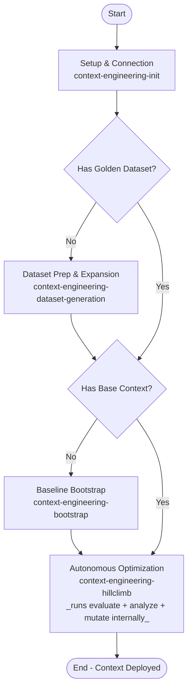

# Skill: Context Engineering Lifecycle

This skill defines the shared vocabulary, lifecycle, and safety rules used by the `context-engineering-*` peer skills. Consult it to orient before invoking a peer, or when a rule reads as "cross-cutting."

---

## Shared Terminology

A **ContextSet** is the structured knowledge blob the Gemini Data Analytics API consumes when translating a natural-language question to SQL. It contains three item types:

*   **Template** — a full NLQ → SQL mapping, generalized with placeholders (e.g., `$1`, `$2`). Teaches end-to-end query patterns.
*   **Facet** — a reusable SQL fragment (e.g., a `WHERE` predicate or a specialized join), tied to specific vocabulary. Composed into generated queries dynamically.
*   **Value Search** — a query that maps user-supplied terms (with typos, casing differences, or synonyms) to their exact database values. Resolves the value-linking problem.

See [context-engineering-generation-guide](../context-engineering-generation-guide/SKILL.md) for the JSON schemas and dialect-specific authoring standards.

---

## The Optimization Lifecycle & Phase Flow

To build high-performing data applications, context engineers typically follow a systematic, iterative optimization lifecycle (Hill-Climbing). 

---

## Where to Start

If you're new, invoke the peer that matches your current state:

*   No `.context-engineering/tools.yaml` → [context-engineering-init](../context-engineering-init/SKILL.md)
*   No golden dataset → [context-engineering-dataset-generation](../context-engineering-dataset-generation/SKILL.md)
*   No base ContextSet → [context-engineering-bootstrap](../context-engineering-bootstrap/SKILL.md)
*   Have a base ContextSet and want autonomous improvement → [context-engineering-hillclimb](../context-engineering-hillclimb/SKILL.md)
*   Have a ContextSet and just want to score it → [context-engineering-evaluate](../context-engineering-evaluate/SKILL.md)

Experienced users can skip this section and invoke any peer directly.

---

## Workflow Phases, Rationales & Entry Prerequisites

---

### Setup & Connection Configuration
*   **Reference**: [context-engineering-init](../context-engineering-init/SKILL.md)
*   **Goal**: Configure `.context-engineering/tools.yaml` for the Toolbox MCP server and verify runtime + GCP setup (uv, evalbench, ADC, Dataplex/GDA APIs, IAM).

---

### Evaluation Dataset Prep & Expansion
*   **Reference**: [context-engineering-dataset-generation](../context-engineering-dataset-generation/SKILL.md)
*   **Goal**: Build a high-quality "golden" ground-truth NLQ+SQL dataset for evaluating translation accuracy.
*   **Requires**: Setup & Connection Configuration complete.

---

### Baseline Context Bootstrapping
*   **Reference**: [context-engineering-bootstrap](../context-engineering-bootstrap/SKILL.md)
*   **Goal**: Generate a baseline `ContextSet` (Templates, Facets, Value Searches) from database schema and optional enrichment sources.
*   **Requires**: Setup & Connection Configuration complete.

---

### Evaluation Scoring
*   **Reference**: [context-engineering-evaluate](../context-engineering-evaluate/SKILL.md)
*   **Goal**: Run Evalbench against a ContextSet + golden dataset to produce an accuracy score and per-query failure breakdown.
*   **Requires**: Setup & Connection Configuration complete; a golden dataset and a ContextSet (local file or Context Store resource name) available.

---

### Autonomous Optimization
*   **Reference**: [context-engineering-hillclimb](../context-engineering-hillclimb/SKILL.md)
*   **Goal**: Autonomously iterate evaluate → analyze → mutate → re-upload until improvements dry up, producing a high-scoring ContextSet with no per-iteration user approval.
*   **Requires**: Setup & Connection Configuration complete; a golden dataset. The base context is optional — hillclimb invokes bootstrap when none is supplied.
*   **Note**: Hillclimb runs evaluate itself every iteration; do not run Evaluation Scoring separately as a precondition.

---

## Safety & Protocol

*   **Missing Dataset**:
    *   If the user's request requires **evaluating, scoring, or optimizing** a context set (e.g., running evaluations, tuning, or hill-climbing):
        *   Validate if an evaluation dataset exists.
        *   **Mandatory Halt & Guide**: If no evaluation dataset exists, you are **strictly forbidden** from executing any context bootstrapping, tuning, or evaluation operations in this turn. You must immediately halt, stop calling tools, and yield the turn. Explain **why a golden evaluation dataset is critical** for context engineering (i.e., you cannot objectively score, validate, or hill-climb translation accuracy without a ground-truth dataset), and ask if they would like help generating one first.

*   **Critical API Error Protocol**:
    *   Seek guidance from the user if you run into results where retrying is unlikely to solve the issue.
    *   Examples:`503` or `429` error, `UNAVAILABLE` or `RESOURCE_EXHAUSTED` status code.
    *   Why: These errors are often associated with quota issues, and retrying the request immediately will not resolve the issue. For issues related to Vertex AI Resource Exhaustion, retrying at a later time is often the only solution.

*   **Environment failures**: For any environment or connection failure (missing `tools.yaml`, MCP tools unreachable, ADC not configured, API not enabled, IAM missing), route through [context-engineering-init](../context-engineering-init/SKILL.md) to diagnose and fix. Do not invent workarounds (e.g., calling Toolbox via bash instead of MCP).