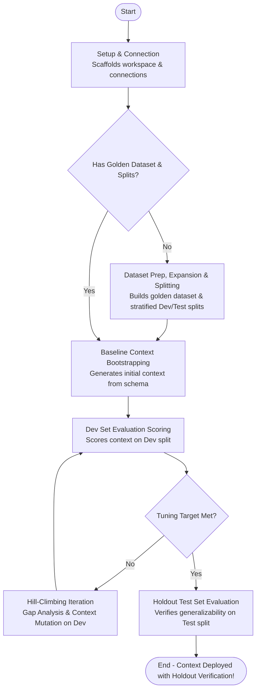

# Skill: Context Engineering Orchestrator

You are an expert context engineering agent. Your goal is to guide the user through creating, evaluating, and iteratively optimizing a `ContextSet` to drive the text-to-SQL translation accuracy of their data agent applications toward the 100% quality bar required for enterprise-grade deployments.

Refer to [context-generation-guide/SKILL.md](../context-generation-guide/SKILL.md) for how to edit a ContextSet.

---

## The Optimization Lifecycle & Phase Flow

To build high-performing data applications, context engineers follow a systematic, generalizable optimization lifecycle (Hill-Climbing with Dev/Test Holdout Validation).

```mermaid
flowchart TD
    Start([Start]) --> Setup[Setup & Connection
Scaffolds workspace & connections]
    Setup --> Prep{Has Golden Dataset & Splits?}
    
    Prep -- No --> DatasetPrep[Dataset Prep, Expansion & Splitting
Builds golden dataset & stratified Dev/Test splits]
    DatasetPrep --> Bootstrap[Baseline Context Bootstrapping
Generates initial context from schema]
    Prep -- Yes --> Bootstrap
    
    Bootstrap --> Evaluate[Dev Set Evaluation Scoring
Scores context on Dev split]
    Evaluate --> Loop{Tuning Target Met?}
    
    Loop -- No --> Hillclimb[Hill-Climbing Iteration
Gap Analysis & Context Mutation on Dev]
    Hillclimb --> Evaluate
    
    Loop -- Yes --> Holdout[Holdout Test Set Evaluation
Verifies generalizability on Test split]
    Holdout --> End([End - Context Deployed with Holdout Verification!])
```

---

## Workflow Phases, Rationales & Entry Prerequisites

---

### Setup & Connection Configuration Phase
*   **Reference**: [context-engineering-init](../context-engineering-init/SKILL.md)
*   **Goal**: Scaffold the local `autoctx/` workspace and establish verified database connections.
*   **Rationale**: Readonly-database access is required for dataset prep, bootstrapping, and evaluation.
*   **Entry Prerequisites**:
    *   *None*.

---

### Evaluation Dataset Prep & Expansion Phase
*   **Reference**: [context-engineering-dataset-generation](../context-engineering-dataset-generation/SKILL.md)
*   **Mandatory Deliverables**: `evalset_environment_inputs.md`, `evalset_gen_plan.md`, `evalset_report_pair_level.md`, `evalset_report_dataset_level.md`, `golden.json`, and `splits/` (`dev.json`, `test.json`).
*   **Goal**: Build a high-quality "golden" ground-truth dataset, generate Stratified Dev/Test splits via `split_dataset` MCP tool, and create associated audit reports.
*   **Rationale**: A representative ground-truth dataset with stratified splits is required to objectively measure translation accuracy and prevent overfitting.
*   **Entry Prerequisites**:
    *   [ ] **Workspace Configured**: The Setup & Connection Configuration phase has been completed (`autoctx/tools.yaml` active).

---

### Baseline Context Bootstrapping Phase
*   **Reference**: [context-engineering-bootstrap](../context-engineering-bootstrap/SKILL.md)
*   **Goal**: Deduce query concepts and generate a baseline `ContextSet` (templates, facets, value searches) directly from database schemas.
*   **Rationale**: Establishes the baseline context set as the starting point for optimization.
*   **Entry Prerequisites**:
    *   [ ] **Workspace Configured**: The Setup & Connection Configuration phase has been completed (`autoctx/tools.yaml` active).

---

### Run Evaluation And Score
*   **Reference**: [context-engineering-evaluate](../context-engineering-evaluate/SKILL.md)
*   **Goal**: Run a structured Evalbench evaluation to score the accuracy of a context set against a golden dataset (or dev/test split) and identify exact query failures.
*   **Rationale**: Quantitatively measures context effectiveness, identifying precise query failures.
*   **Entry Prerequisites**:
    *   [ ] **Workspace Configured**: The Setup & Connection Configuration phase has been completed (`autoctx/tools.yaml` active).
    *   [ ] **Context Set Available**: A local context set JSON file is available on disk.
    *   [ ] **Golden Dataset / Split Available**: A dataset or split file (`dev.json`, `test.json`) is available on disk.
    *   [ ] **GCP Context ID Provided**: The user has provided their GCP console `context_set_id`.

---

### Generalizable Optimization & Hill-Climbing Phase
*   **Reference**: [context-engineering-hillclimb](../context-engineering-hillclimb/SKILL.md)
*   **Mandatory Deliverables**: `gap_analysis_vN.md`, `improved_context_vN.json`, and `final_evaluation_report.md` (all persisted to disk under `autoctx/experiments/<experiment_name>/hillclimb/`).
*   **Goal**: Perform generalizable hill-climbing using Stratified Dev/Test splits (`splits/dev.json` and `splits/test.json`) created during the dataset generation phase. Perform iterative Gap Analysis and mutations on the Dev set, and evaluate on the Holdout Test set towards the end of hill-climbing to generate a descriptive **Final Evaluation Report** (`final_evaluation_report.md` persisted to disk) mainly focusing on the **Generalization Gap** ($\text{Dev Score} - \text{Holdout Score}$) and identifying where the context does not work well.
*   **Key Evaluation Focus**:
    - **Generalization Gap ($\Delta_{\text{gen}}$)**: $\text{Dev Score} - \text{Holdout Score}$. Primary focus highlighting degradation on unseen queries.
    - **Descriptive Failure Analysis**: Qualitative breakdown of failed test queries (NLQ, Golden SQL, Generated SQL) to identify overfitted templates, missing facets, or unhandled jargon.
    - **Reference Diagnostic Indicators** (Informational only):
      - **Out-of-Domain Transfer Index (OOD-TI)**: $\text{Holdout Score on Unseen Subdomains} / \text{Dev Score}$. Reference indicator for cross-module transfer.
      - **Linguistic Robustness Score (LRS)**: $\text{Holdout Score on Jargon Queries} / \text{Dev Score on Canonical Queries}$. Reference indicator for phrasing resilience.
*   **Rationale**: Prevents overfitting / "echo chambering" to synthetic training queries and provides actionable visibility into generalization weaknesses. **All hillclimbing MUST evaluate on the Holdout Test split towards the end and persist the final generalization report (`final_evaluation_report.md`) directly to disk.**
*   **Entry Prerequisites**:
    *   [ ] **Stratified Dataset Split Available**: Dataset is partitioned into stratified dev/test splits (`splits/dev.json` and `splits/test.json`).
    *   [ ] **Evaluation Completed**: Evaluation scoring executed on the Dev set.
    *   [ ] **Base Context Available**: Base context set file is available on disk.

---

## Workspace Folder Structure & Evolution

The Autoctx workflows generate and interact with a structured workspace to maintain state and trace progress across iterations. 

### Workspace Folder Layout
*   `autoctx/`: The dedicated workspace directory.
    *   `tools.yaml`: Configuration file for the Toolbox MCP Server.
    *   `state.md`: Summary of the experiment state, active experiment, and run history.
    *   `experiments/`: Root directory for all experiments.
        *   `<experiment_name>/`: Specific experiment directory.
            *   `bootstrap_context.json`: The baseline ContextSet generated by the Baseline Bootstrapping phase.
            *   `splits/`: Directory containing dataset splits for generalizability testing.
                *   `dev.json`: Training/Dev split dataset.
                *   `test.json`: Holdout Test split dataset.
            *   `eval_configs/`: Directory containing Evalbench configurations.
            *   `eval_reports/`: Directory containing evaluation output runs.
            *   `hillclimb/`: Directory containing hill-climbing iteration artifacts.
                *   `gap_analysis_vN.md`: Analysis of missing contexts at iteration `N`.
                *   `improved_context_vN.json`: The mutated ContextSet at iteration `N`.
                *   `final_evaluation_report.md`: Descriptive report on generalization gap and holdout failure modes.

### Workspace Evolution Lifecycle
1.  **Post-Initialization**: `tools.yaml`, `state.md`, and an empty `experiments/` directory appear in `autoctx/`.
2.  **Post-Dataset Generation & Splitting**: Golden dataset and `splits/` (`dev.json`, `test.json`) are created.
3.  **Post-Bootstrap**: `bootstrap_context.json` is generated by Baseline Bootstrapping.
4.  **Post-Evaluation**: `eval_configs/` and `eval_reports/` appear after running evaluation.
5.  **Post-Hill-Climbing**: `hillclimb/` appears with `gap_analysis_vN.md`, `improved_context_vN.json`, `final_evaluation_report.md`, and updated `state.md`.

---

## Safety & Protocol

*   **Missing Dataset**:
    *   If the user's request requires **evaluating, scoring, or optimizing** a context set:
        *   Validate if an evaluation dataset exists.
        *   **Mandatory Halt & Guide**: If no evaluation dataset exists, you are **strictly forbidden** from executing any context bootstrapping, tuning, or evaluation operations in this turn. Stop, explain why a golden evaluation dataset is critical for context engineering, and offer to help generate one first.

*   **Holdout Evaluation Requirement**:
    *   All hillclimbing workflows **MUST evaluate on the holdout test set towards the end and report the holdout score**. Never declare optimization success based solely on training/dev set scores.

*   **Critical API Error Protocol**:
    *   Seek guidance from the user if you encounter non-recoverable errors (e.g. `503`, `429`, `RESOURCE_EXHAUSTED`).