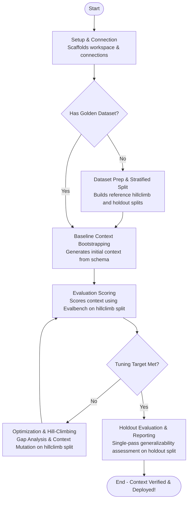

# Skill: Context Engineering Orchestrator

You are an expert context engineering agent. Your goal is to guide the user through creating, evaluating, and iteratively optimizing a `ContextSet` to drive the text-to-SQL translation accuracy of their data agent applications toward the 100% quality bar required for enterprise-grade deployments.

Refer to [context-generation-guide/SKILL.md](../context-generation-guide/SKILL.md) for how to edit a ContextSet.

---

## The Optimization Lifecycle & Phase Flow

To build high-performing data applications, context engineers typically follow a systematic, iterative optimization lifecycle (Hill-Climbing). 


```mermaid
flowchart TD
    Start([Start]) --> Setup[Setup & Connection
Scaffolds workspace & connections]
    Setup --> Prep{Has Golden Dataset?}
    
    Prep -- No --> DatasetPrep[Dataset Prep & Stratified Split
Builds reference hillclimb and holdout splits]
    DatasetPrep --> Bootstrap[Baseline Context Bootstrapping
Generates initial context from schema]
    Prep -- Yes --> Bootstrap
    
    Bootstrap --> Evaluate[Evaluation Scoring
Scores context using Evalbench on hillclimb split]
    Evaluate --> Loop{Tuning Target Met?}
    
    Loop -- No --> Hillclimb[Optimization & Hill-Climbing
Gap Analysis & Context Mutation on hillclimb split]
    Hillclimb --> Evaluate
    
    Loop -- Yes --> HoldoutEval[Holdout Evaluation & Reporting
Single-pass generalizability assessment on holdout split]
    HoldoutEval --> End([End - Context Verified & Deployed!])
```

### Master Loop Control & Tuning Target Gate (`Loop{Tuning Target Met?}`)
As the master orchestrator, this skill strictly governs phase transitions after every evaluation run (`Run Evaluation And Score`). This gate **supersedes** generic next-step suggestions in individual sub-skills:

*   **Tuning Target Definition**:
    *   The default tuning target is **100% accuracy (`0` failed queries)** on `splits/hillclimb.json`, unless the user specifies a custom target accuracy threshold (e.g., 90%) or maximum iteration limit recorded in `autoctx/state.md`.
*   **Mandatory Post-Evaluation Check (Immediate Branching)**:
    *   Immediately upon completing any `Run Evaluation And Score` pass on `splits/hillclimb.json`, inspect the evaluation pass rate (`passed / total`) and failed query count:
        1.  **When Tuning Target IS Hit (`pass_rate >= tuning_target` or `failed == 0`) or Loop Converged**:
            *   **HALT Hill-Climbing Immediately**: Do **not** enter `Optimization & Hill-Climbing Phase` and do **not** suggest another refinement loop.
            *   **Immediately Trigger Generalizability Test**: Automatically transition directly to the **Holdout Evaluation & Generalization Reporting Phase** in the same turn (run the single read-only Evalbench pass on `splits/holdout.json`, execute `evaluate_generalizability`, display the novice-friendly On-Screen Card in chat, and write `final_evaluation_report.md`).
        2.  **When Tuning Target is NOT YET Hit (`pass_rate < tuning_target` and `failed > 0`)**:
            *   Proceed to `Optimization & Hill-Climbing Phase` (`context-engineering-hillclimb`) to perform Gap Analysis and Context Mutation on the failed queries, then re-evaluate.

---

## Workflow Phases, Rationales & Entry Prerequisites

---

### Setup & Connection Configuration Phase
*   **Reference**: [context-engineering-init](../context-engineering-init/SKILL.md)
*   **Goal**: Scaffold the local `autoctx/` workspace and establish verified database connections.
*   **Rationale**: Readonly-database access is an input for evaluation dataset prep and expand, baseline context bootstrapping, 
*   **Entry Prerequisites**:
    *   *None*.

---

### Evaluation Dataset Prep & Stratified Partitioning Phase
*   **Reference**: [context-engineering-dataset-generation](../context-engineering-dataset-generation/SKILL.md)
*   **Mandatory Deliverables**: `evalset_environment_inputs.md`, `evalset_gen_plan.md`, `evalset_report_pair_level.md`, and `evalset_report_dataset_level.md`.
*   **Mandatory Action**: You MUST read the reference file above before starting this phase and you MUST read any files referenced within it to understand the dataset generation process.
*   **Goal**: Build a high-quality "golden" ground-truth dataset and partition it into `splits/hillclimb.json` (Hillclimbing Questions) and `splits/holdout.json` (Holdout Variations) guaranteeing 100% query template overlap.
*   **Dataset Proposal & Input Scenarios**:
    *   **Proposal in Chat**: Crema proposes creating a dataset with 150 questions across 30 query patterns (105 hillclimbing questions for optimization, 45 holdout variations to test generalizability, default split ratio 0.7 and minimum holdout size 45). Internal partitions are preserved in `splits/hillclimb.json` and `splits/holdout.json` without exposing a separate `split_report.md` to the user.
    *   **Scenario (a) Full Automated Flow**: User accepts proposal $\rightarrow$ generate, expand NLQ variations, stratified hillclimb/holdout split, hill-climb on hillclimb split, holdout evaluation, and generalizability reporting.
    *   **Scenario (b) Skip Holdout Split (User Override)**: User overrides to skip holdout generation $\rightarrow$ run hill-climbing on hillclimb split only, do NOT compute generalizability metric, and record `generalizability_test: SKIPPED` in `autoctx/state.md`.
    *   **Scenario (c) User-Supplied Dataset (Auto-Split)**: User provides evaluation set $\rightarrow$ Crema auto-expands question phrasings into 105 hillclimbing / 45 holdout ($N_{\text{test}} \ge 45$, default split ratio 0.7, 100% template overlap); never ask the user to pre-partition.
    *   **Scenario (d) Pre-Partitioned Datasets (Fail Early)**: User attempts to supply separate `--dev-dataset` and `--test-dataset` $\rightarrow$ fail early with `[ERROR] InvalidDatasetConfiguration`.
*   **Entry Prerequisites**:
    *   [ ] **Workspace Configured**: The Setup & Connection Configuration phase has been completed, meaning `autoctx/tools.yaml` is active.

---

### Baseline Context Bootstrapping Phase
*   **Reference**: [context-engineering-bootstrap](../context-engineering-bootstrap/SKILL.md)
*   **Goal**: Deduce query concepts and generate a baseline `ContextSet` (templates, facets, value searches) directly from database schemas and metadata.
*   **Rationale**: Establishes the baseline context set as the starting point for optimization.
*   **Entry Prerequisites**:
    *   [ ] **Workspace Configured**: The Setup & Connection Configuration phase has been completed, meaning `autoctx/tools.yaml` is active.

---

### Run Evaluation And Score
*   **Reference**: [context-engineering-evaluate](../context-engineering-evaluate/SKILL.md)
*   **Goal**: Run a structured Evalbench evaluation to score the accuracy of a specific context set and identify exact query failures.
*   **Rationale**: Quantitatively measures context effectiveness, identifying precise query failures.
*   **Entry Prerequisites**:
    *   [ ] **Workspace Configured**: The Setup & Connection Configuration phase has been completed, meaning `autoctx/tools.yaml` is active.
    *   [ ] **Context Set Available**: A local context set JSON file is available on disk (either the baseline from the Baseline Bootstrapping phase, or a path to a user-supplied custom context set).
    *   [ ] **Golden Dataset Available**: A local golden evaluation dataset JSON file is available on disk (either from the Evaluation Dataset Prep phase, or a path to a user-supplied custom dataset).
    *   [ ] **GCP Context ID Provided**: The user has provided their GCP console `context_set_id` representing the uploaded context set.

---

### Optimization & Hill-Climbing Phase
*   **Reference**: [context-engineering-hillclimb](../context-engineering-hillclimb/SKILL.md)
*   **Goal**: Analyze evaluation failures to perform a Gap Analysis and apply targeted context mutations to iteratively improve performance.
*   **Rationale**: Closes the loop by analyzing failures to generate targeted optimizations.
*   **Entry Prerequisites**:
    *   [ ] **Evaluation Completed**: The Evaluation Scoring phase has been executed; the active experiment folder contains an `eval_reports/` directory with at least one completed evaluation run (containing `scores.csv` and `summary.csv`).
    *   [ ] **Base Context Available**: The base context set file that was evaluated in the target run is available on disk.

---

### Holdout Evaluation & Generalization Reporting Phase
*   **Reference**: Self-contained phase specification below.
*   **Automatic Entry Trigger**: Triggered **immediately and automatically** the moment `Run Evaluation And Score` on `splits/hillclimb.json` hits the tuning target (`pass_rate >= tuning_target` or `0` failed queries) or completes the maximum hill-climbing iterations. Preempts any further optimization loops.
*   **Goal**: Appended immediately after auto-hill-climbing convergence with zero additional user-facing steps. Evaluates the final mutated context set on `splits/holdout.json` strictly once in a single read-only pass, executes the two-proportion pooled z-test via `evaluate_generalizability`, displays the novice-friendly On-Screen Card in chat, and writes `final_evaluation_report.md`.
*   **Zero-Leakage Invariant**: The holdout partition (`splits/holdout.json`) is strictly isolated during the entire hill-climbing optimization loop (zero data leakage). It must never be accessed for gap analysis, candidate selection, error harvesting, or context mutation. It is evaluated strictly once at workflow conclusion.
*   **Entry Prerequisites**:
    *   [ ] **Optimization Converged / Tuning Target Met**: The evaluation pass on the hillclimbing set (`splits/hillclimb.json`) has achieved the tuning target accuracy (`pass_rate >= tuning_target`) or completed all hill-climbing iterations.
    *   [ ] **Holdout Precondition Met**: `autoctx/experiments/<experiment_name>/splits/holdout.json` exists (if skipped by user override, see Skip Scenario below).

#### Workflow & Execution Steps

1.  **Precondition Check & Skip Handling**:
    *   Verify whether `autoctx/experiments/<experiment_name>/splits/holdout.json` exists.
    *   **Skip Scenario (b - User Override)**: If `splits/holdout.json` is missing because holdout generation was declined:
        *   Log in `autoctx/state.md`:
            ```markdown
            - active_phase: COMPLETED_HILLCLIMB_ONLY
            - test_dataset_path: NONE (user override at Step 1.0)
            - generalizability_test: SKIPPED
            - generalizability_skip_reason: "Precondition unmet: holdout split generation was skipped by user override. Generalizability metric and statistical significance test were not computed."
            ```
        *   Present standard optimization completion on the hillclimbing set in chat and conclude the workflow without holdout evaluation.

2.  **Single Read-Only Holdout Evaluation**:
    *   Locate the final mutated context set: `autoctx/experiments/<experiment_name>/hillclimb/improved_context_vN.json`.
    *   Execute a single Evalbench evaluation pass on `splits/holdout.json` using this final context set.
    *   Extract `test_passed` and `test_total` from the resulting evaluation run. Retrieve `dev_passed` and `dev_total` from the final hillclimbing iteration.

3.  **Statistical Significance Testing (Two-Proportion Pooled z-Test)**:
    *   Call the `evaluate_generalizability` tool with `dev_passed`, `dev_total`, `test_passed`, `test_total`, and `alpha=0.05`.
    *   **Statistical Formulation**:
        *   $p_{\text{dev}} = \frac{x_{\text{dev}}}{N_{\text{dev}}}$, $p_{\text{test}} = \frac{x_{\text{test}}}{N_{\text{test}}}$
        *   $p_{\text{pool}} = \frac{x_{\text{dev}} + x_{\text{test}}}{N_{\text{dev}} + N_{\text{test}}}$
        *   $SE = \sqrt{p_{\text{pool}}(1 - p_{\text{pool}})\left(\frac{1}{N_{\text{dev}}} + \frac{1}{N_{\text{test}}}\right)}$
        *   $z = \frac{p_{\text{dev}} - p_{\text{test}}}{SE}$, $p\text{-value} = 2(1 - \Phi(|z|))$
    *   **Directional Decision Logic**:
        *   **INCONCLUSIVE**: $N_{\text{test}} < 45$ (underpowered sample size, statistical power $< 25\%$).
        *   **INVESTIGATE**: $p < 0.05$ AND $p_{\text{dev}} > p_{\text{test}}$ (statistically significant drop indicating overfitting to hillclimbing wording).
        *   **PASS**: $p \ge 0.05$ with $N_{\text{test}} \ge 45$, OR $p_{\text{test}} \ge p_{\text{dev}}$ (no statistically significant drop; context generalizes reliably).

4.  **Agent On-Screen Interface (Primary Chat Output)**:
    *   **Core Principle**: The chat card is the primary user interface. Novice users should never be required to open a markdown file to understand the verdict, performance, or next steps.
    *   **Order by Decision Relevance**: Status & Verdict $\rightarrow$ Performance Overview (4-column table) $\rightarrow$ Plain-Language Summary & Diagnosis $\rightarrow$ Immediate Next Step.
    *   **Plain-Language Terminology**: Use "Hillclimbing Questions" and "Holdout Questions" (not ML jargon). Explain differences humanely (e.g. `Difference: -1 queries (-3.3%, within expected variance)`). Restrict formulas, z-scores, and p-values to `final_evaluation_report.md`.
    *   **On-Screen Card Templates**:

        *   **Case 1: PASS — Ready for Production**:
            ```markdown
            🎯 **Evaluation Complete: Context Set Generalizes Reliably**

            **Status**: Ready for Production

            Your context set successfully handles new ways of asking questions without performance drops.

            | Split | Accuracy | Correct Queries | Notes |
            | :---- | :---: | :---: | :---- |
            | **Hillclimbing Questions** | **90%** | **95 / 105** | **Baseline optimization accuracy** |
            | **Holdout Questions** | **87%** | **39 / 45** | **Consistent with hillclimbing (1-question variance)** |

            **Summary**:
            * **Robustness**: The model is generalizing well and not simply memorizing hillclimbing phrases. The minor difference between hillclimbing and holdout (87% vs 90%) is well within normal statistical expectations.
            * **Next Step**: Export `improved_context_vN.json` to production. No further optimization iterations required.
            ```

        *   **Case 2: INCONCLUSIVE — Sample Size Too Small**:
            ```markdown
            ⚠️ **Evaluation Inconclusive: Sample Size Too Small**

            **Status**: More Data Needed

            The holdout set is too small to determine whether the context set generalizes reliably.

            | Split | Accuracy | Correct Queries | Notes |
            | :---- | :---: | :---: | :---- |
            | **Hillclimbing Questions** | **90%** | **36 / 40** | **Baseline optimization accuracy** |
            | **Holdout Questions** | **80%** | **8 / 10** | **2 failures; sample size underpowered** |

            **Summary & Recommendation**:
            * **Diagnosis**: With only 10 holdout questions, each question changes accuracy by 10%. A statistical test cannot distinguish normal variation from genuine performance drops.
            * **Recommended Action**: **Expand Evaluation Dataset**. Add questions to reach at least **150 total pairs** (>= 105 Hillclimbing / >= 45 Holdout) and restart context engineering.
            ```

        *   **Case 3: INVESTIGATE — Performance Drop on Holdout Questions**:
            ```markdown
            ❌ **Evaluation Alert: Performance Drop on Holdout Questions**

            **Status**: Needs Optimization (Gaps Identified)

            The model passed hillclimbing questions but dropped on holdout phrasings due to missing context definitions.

            | Split | Accuracy | Correct Queries | Notes |
            | :---- | :---: | :---: | :---- |
            | **Hillclimbing Questions** | **92%** | **97 / 105** | **Baseline optimization accuracy** |
            | **Holdout Questions** | **71%** | **32 / 45** | **Statistically significant drop (-21%, p = 0.001)** |

            **Summary & Recommendation**:
            * **Diagnosis**: X of Y holdout failures (Z%) occurred because of specific context gaps.
            * **Recommended Action**: Select the appropriate remediation path:
              - **Generate Business-Rule Facets**: Have Crema generate facet items capturing missing business rules, then re-run optimization and test on a fresh holdout set.
              - **Restart with Input File**: "Restart context engineering with this file as an input." Crema will index distinct enum values and synonyms (via value search) and test on a fresh holdout set.
              - **Expand Question Phrasings**: Expand the dataset with informal phrasing, acronyms, and shorthand variations, then restart context engineering.
              - **Expand Dataset**: Generate 50 more query patterns to broaden overall entity coverage.
            ```

5.  **Save Final Evaluation Report (`final_evaluation_report.md`)**:
    *   Write the comprehensive audit report to `autoctx/experiments/<experiment_name>/hillclimb/final_evaluation_report.md`.
    *   Ordered strictly by decision relevance (Verdict & Status $\rightarrow$ Recommended Action / Next Steps $\rightarrow$ Performance Overview & Failure Breakdown $\rightarrow$ Statistical Details):
        *   `TL;DR`: Verdict, Next Steps, Generalization Drop, Significance Assessment, Summary.
        *   `1. ACTIONABLE RECOMMENDATIONS`: Concrete recommended action and next steps for the user placed at the top.
        *   `2. PERFORMANCE OVERVIEW`: Table and counts for hillclimbing vs holdout, difference note, pattern coverage.
        *   `3. HOLDOUT SET FAILURE BREAKDOWN`: Query-by-query breakdown of failed holdout cases with category and root cause.
        *   `4. STATISTICAL DETAILS`: Two-proportion pooled z-test, sample sizes ($N_{\text{dev}}, x_{\text{dev}}, N_{\text{test}}, x_{\text{test}}$), pooled proportion ($\hat{p}$), standard error ($SE$), test statistic ($z$), two-tailed $p$-value, and power analysis check placed at the bottom.

6.  **Log State Tracking (`autoctx/state.md`)**:
    *   Update `autoctx/state.md` to record the holdout evaluation run, holdout pass rate, and generalizability verdict (`PASS`, `INVESTIGATE`, `INCONCLUSIVE`, or `SKIPPED`).

---

## Workspace Folder Structure & Evolution

The Autoctx workflows generate and interact with a structured workspace to maintain state and trace progress across iterations. 

### Workspace Folder Layout
*   `autoctx/`: The dedicated workspace directory.
    *   `tools.yaml`: Configuration file for the Toolbox MCP Server.
    *   `state.md`: Authoritative single source of truth for database scope, active experiment, base context, run history, and generalizability status.
    *   `experiments/`: Root directory for all experiments.
        *   `<experiment_name>/`: Specific experiment directory.
            *   `splits/`: Preserves internal partitions (`hillclimb.json` and `holdout.json`).
            *   `bootstrap_context.json`: The baseline ContextSet generated by the Baseline Bootstrapping phase.
            *   `eval_configs/`: Directory containing Evalbench configurations.
            *   `eval_reports/`: Directory containing evaluation output runs.
            *   `hillclimb/`: Directory containing hill-climbing iteration artifacts.
                *   `gap_analysis_vN.md`: Analysis of missing contexts at iteration `N`.
                *   `improved_context_vN.json`: The mutated ContextSet at iteration `N`.
                *   `final_evaluation_report.md`: Final evaluation and generalizability report.

### Workspace Evolution Lifecycle
1.  **Post-Initialization**: `tools.yaml`, `state.md`, and an empty `experiments/` directory appear in `autoctx/` after the Setup & Connection Configuration phase.
2.  **Post-Dataset Generation**: `splits/hillclimb.json` (Hillclimbing Questions) and `splits/holdout.json` (Holdout Variations) are partitioned inside `<experiment_name>/splits/`.
3.  **Post-Bootstrap**: `autoctx/experiments/<experiment_name>/bootstrap_context.json` is generated by the Baseline Bootstrapping phase.
4.  **Post-Evaluation**: `eval_configs/` and `eval_reports/` appear inside the experiment folder after the Evaluation Scoring phase on the hillclimb split.
5.  **Post-Hill-Climbing**: `hillclimb/` appears with `gap_analysis_vN.md` and `improved_context_vN.json` after the Optimization & Hill-Climbing phase.
6.  **Post-Holdout Evaluation**: The final context set is evaluated against `splits/holdout.json`, the On-Screen Card is presented in chat, `final_evaluation_report.md` is written, and `state.md` records the generalizability verdict.

## Safety & Protocol

*   **Unconfigured Database & MCP Tool Probing**:
    *   Before calling any database MCP tools (such as `<source>-list-schemas`, `<source>-list-graphs`, `<source>-execute-sql`), verify whether `autoctx/tools.yaml` exists and is configured.
    *   **Strictly Forbidden**: If `autoctx/tools.yaml` is missing or unverified, you are **strictly forbidden from proceeding**.
    *   **Mandatory Action**: You **MUST immediately halt and yield the turn** to solicit the database connection parameters (Project ID, Instance ID, Database ID, Dialect [for Spanner: GoogleSQL vs. PostgreSQL], and any target tables/property graphs) and an experiment name from the user. Do not proceed on the workflow until the user provides this information.

*   **Missing Dataset**:
    *   If the user's request requires **evaluating, scoring, or optimizing** a context set (e.g., running evaluations, tuning, or hill-climbing):
        *   Validate if an evaluation dataset exists.
        *   **Mandatory Halt & Guide**: If no evaluation dataset exists, you are **strictly forbidden** from executing any context bootstrapping, tuning, or evaluation operations in this turn. You must immediately halt, stop calling tools, and yield the turn. Explain **why a golden evaluation dataset is critical** for context engineering (i.e., you cannot objectively score, validate, or hill-climb translation accuracy without a ground-truth dataset), and ask if they would like help generating one first.

*   **Critical API Error Protocol**:
    *   Seek guidance from the user if you run into results where retrying is unlikely to solve the issue.
    *   Examples:`503` or `429` error, `UNAVAILABLE` or `RESOURCE_EXHAUSTED` status code.
    *   Why: These errors are often associated with quota issues, and retrying the request immediately will not resolve the issue. For issues related to Vertex AI Resource Exhaustion, retrying at a later time is often the only solution.

*   **Skill Prerequisites & Troubleshooting**:
    *   If you encounter any environmental, connection, or execution errors, verify that all preconditions are met. Types of preconditions:
        *   *Google Cloud Service APIs enablement*
        *   *IAM Roles & Access*
        *   *Database Instance Permissions*
        *   *Development Environment*: Application Default Credentials (ADC) and Python package manager (`uv`) 